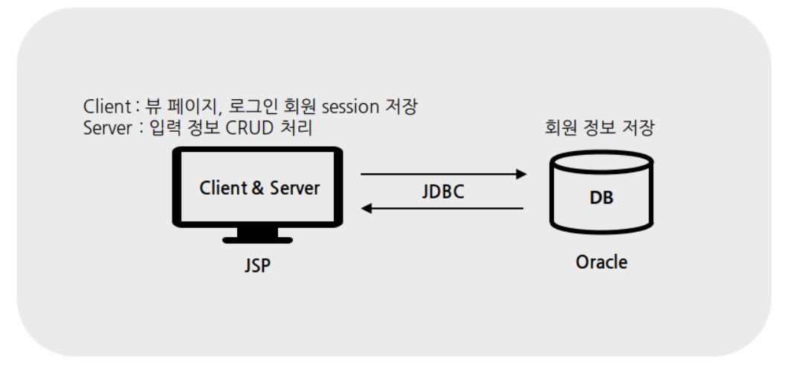

# 1. 소개

Model 1 - JSP 구조로 구현한 웹 사이트 입니다.

---

팀 프로젝트 (구성원: 5명)

개발기간: 1개월

배포여부: No

---

- 흐름

## 2. 내가 구현한 주요 기능

로그인 / 회원가입 / 마이페이지

로그아웃 / 회원탈퇴

아이디 중복 체크 / 아이디 저장

회원 정보 수정

이미지 파일 업로드 및 수정

관리자용 페이지 - 회원 리스트 출력

## 3. 적용기술

-	**웹 화면 구성** : HTML5, CSS3, JavaScript, bootstrap4

-	**검색 결과 데이터 요청 및 출력** : jQuery

-	**결과를 얻어오기 위한 서버 액션** : JAVA, Servlet,JSP, EL

-	**DB 액션 처리** : JDBC

-	**DBMS** : Oracle

## 4. 구현내용 및 배운 점

**3가지 로그인방식(관리자/회원/게스트)에 따른 nav bar 변경 → session에 저장된 회원 정보 조회**

JSP에서 session을 조회하여 저장된 정보에 따라 조건문을 실행하였습니다.

**회원탈퇴 시 아이디가 FK로 잡혀있는 다른 테이블에서 회원정보 먼제 삭제 → 중간에 에러발생시 ‘트렌젝션 RollBack’**

FK와 PK의 개념을 익히고, 트렌젝션의 정상 또는 비정상적인 종료에 따라 commit과 rollback하는 법을 배웠습니다.

**아이디 저장 → Cookie 저장**

Cookie의 개념을 익히고, 이를 아이디 저장 기능에 적용했습니다.

**페이지 이동 없이 중복 아이디 체크 → Ajax**

처음으로 Ajax를 활용해보며 페이지 이동없이 Server에 접속하는 법을 배웠습니다.

**회원목록 : 회원 5명 /per page로 보여주기 → Pagination**

Pagination을 통해 한정된 네트워크 자원을 효율적으로 활용하기 위해 쿼리의 결과값으로 리턴된 리소스를 분할하여 네트워크 낭비를 막았습니다.

## 5. 프로젝트 설명PPT

[https://docs.google.com/presentation/d/1EauMrOTfBaX5EO4ViAfn-WJ5A2SSByDyqIp3bTpcxXA/edit#slide=id.g5da0f9af3b_7_0](https://docs.google.com/presentation/d/1EauMrOTfBaX5EO4ViAfn-WJ5A2SSByDyqIp3bTpcxXA/edit#slide=id.g5da0f9af3b_7_0)
